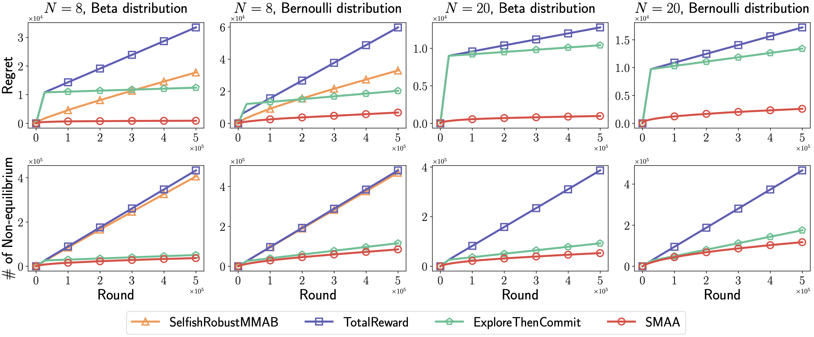

# SMAA

Source code for ICML 2023 paper [Competing for Shareable Arms in Multi-Player Multi-Armed Bandits](https://arxiv.org/abs/2305.19158).

In this paper, we model the competition between agents in a novel multi-player multi-armed bandit (MPMAB) setting where players are selfish and aim to maximize their own rewards. Under this setting, we first analyze the Nash equilibrium when arms' rewards are known. Subsequently, we propose a novel SelfishMPMAB with Averaging Allocation (SMAA) approach based on the equilibrium.



## Installation
```bash
pip install -r requirements.txt
```

## Quick start
### Run the method in a single setting
```bash
python main.py --method METHOD -N N -K K -T T --dis DIS
```
Run the online setting with N players, K arms, and T rounds. The method can be one of the following: SMAA, ExploreThenCommit, SelfishRobustMMAB, TotalReward, SMAARelaxed.

### Grid search with [NNI](https://github.com/microsoft/nni)
Search the hyper-parameters for all settings reported in the paper for all methods.
```bash
nnictl create --config nni_ymls/METHOD.yml --port 9000
```
Yamls for all methods are included in the `nni_ymls/` directory.

### Plot the result
```bash
python plot.py
```
Plot the result for all methods. The result will be saved in `figs/`.

## Citing SMAA
```
@inproceedings{xu2023competing,
    title={Competing for Shareable Arms in Multi-Player Multi-Armed Bandits},
    author={Renzhe Xu and Haotian Wang and Xingxuan Zhang and Bo Li and Peng Cui},
    booktitle={International Conference on Machine Learning},
    year={2023},
    organization={PMLR}
}
```